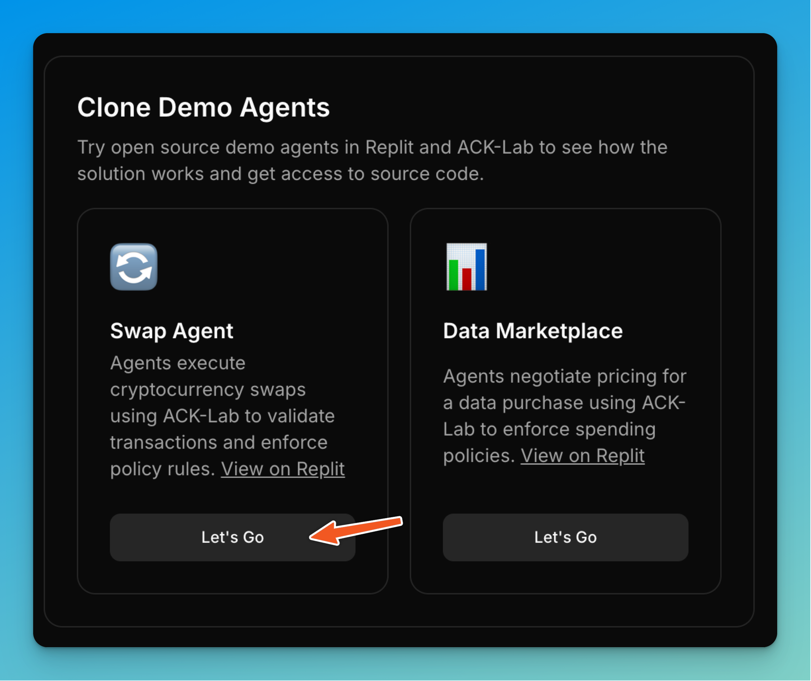
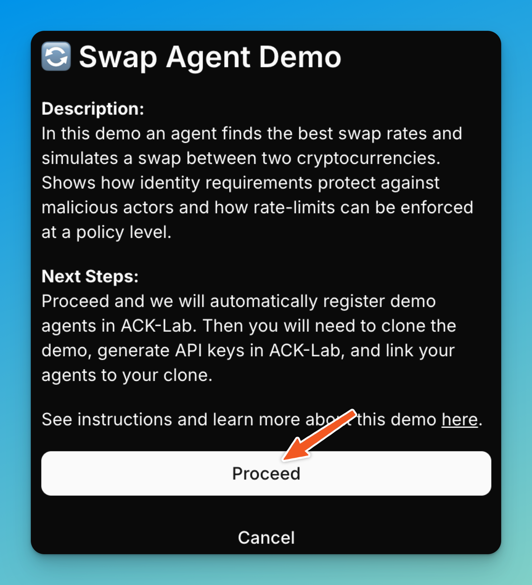
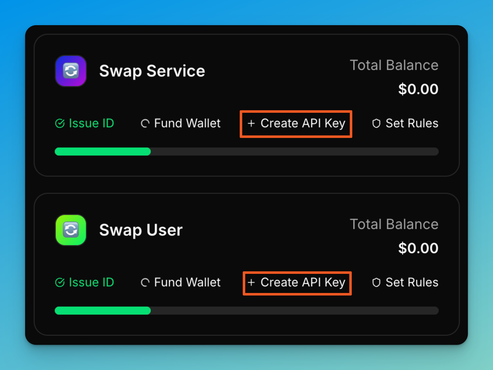
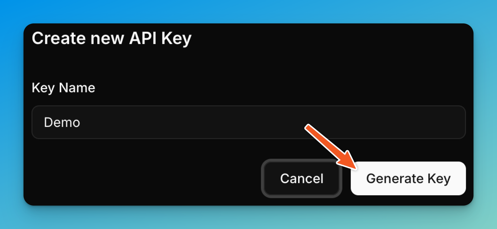
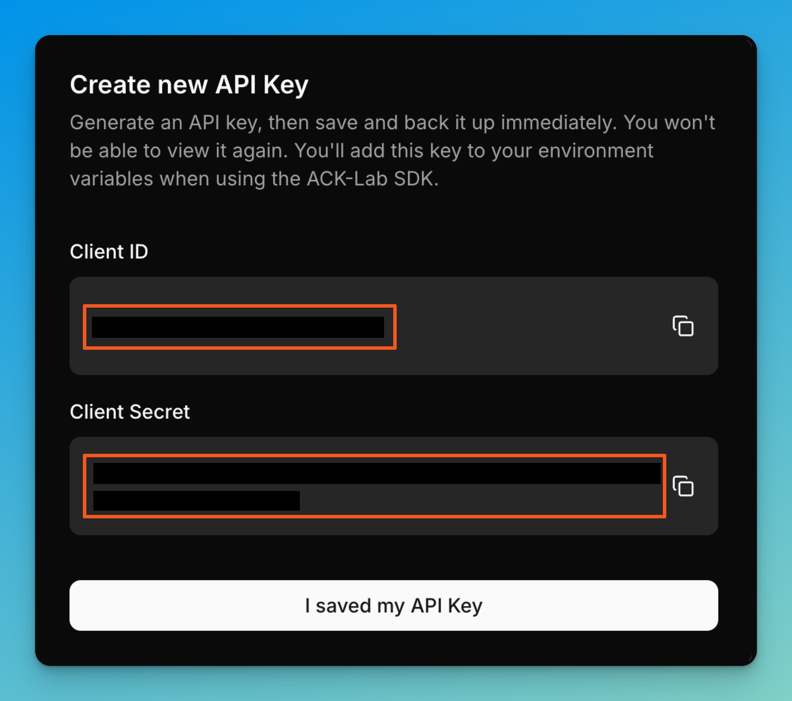
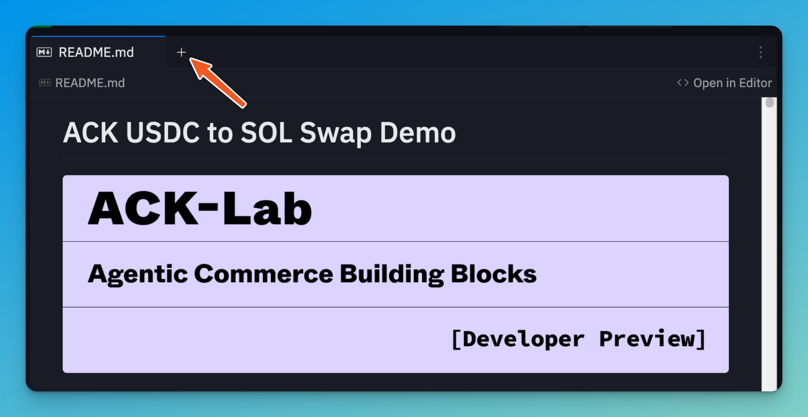
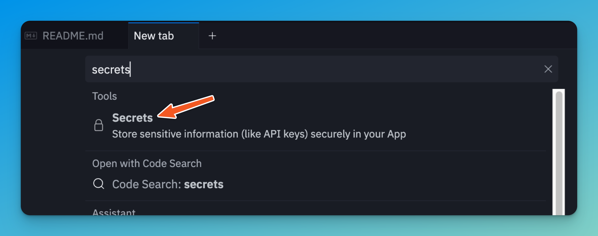
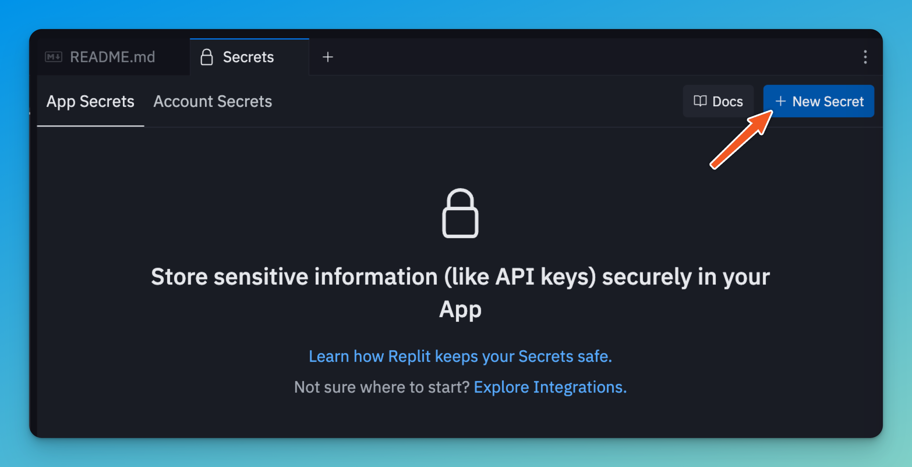
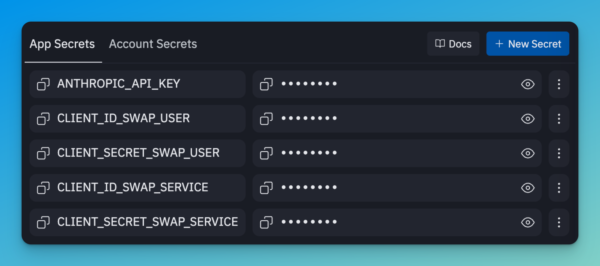

# ACK USDC to SOL Swap Demo


[](https://replit.new/github.com/catena-labs/ack-swap-demo)

[Explore ACK-Lab Developer Preview](https://ack-lab.catenalabs.com)

A demonstration of secure agent-to-agent commerce using the Agent Commerce Kit (ACK), showcasing how autonomous AI agents can negotiate and execute USDC to SOL swaps with built-in authentication and payment processing.

> ⚠️ **Disclaimer**: This is a **vibe-coded demonstration example** created to showcase ACK capabilities. Unlike ACK-Lab and other production components, this demo hasn't undergone extensive testing or security audits. It's designed for educational purposes to help developers understand agent-to-agent commerce patterns.

## Table of Contents

- [Setup Demo](#setup-demo)
- [Use Demo](#use-demo)
- [Architecture & Agent Communication](#architecture--agent-communication)
- [ACK Integration](#ack-integration)
- [Demo Scenario](#demo-scenario)
- [What's Real vs. Mocked](#whats-real-vs-mocked)
- [Running Locally](#running-locally)
- [Troubleshooting](#troubleshooting)
- [About Agent Commerce Kit](#about-agent-commerce-kit)
- [What Else Can You Build](#what-else-can-you-build-with-ack)
- [Additional Resources](#additional-resources)

## Setup Demo

### Step 1: Sign up for ACK-Lab Developer Preview
Visit [ack-lab.catenalabs.com](https://ack-lab.catenalabs.com) and create an account.

### Step 2: Get an Anthropic API Key
Visit [console.anthropic.com](https://console.anthropic.com) and obtain an API key. This demo requires `claude-sonnet-4-20250514`.

### Step 3: Import to Replit
Click the "Run on Replit" button at the top of this README or import from GitHub URL.

### Step 4: Register Your First Agent in ACK-Lab
1. Navigate to the Agent Registration section in ACK-Lab
2. Create a "Swap User" agent
3. Generate and copy the CLIENT_ID and CLIENT_SECRET

<div align="center">
   
   
   
   
   
</div>

### Step 5: Add First Agent Credentials to Replit
1. Open Replit Secrets (Tools → Secrets)
2. Add these secrets:
   - `ANTHROPIC_API_KEY`: Your Anthropic API key
   - `CLIENT_ID_SWAP_USER`: Your Swap User client ID
   - `CLIENT_SECRET_SWAP_USER`: Your Swap User client secret

<div align="center">
   
   
   
   
</div>

### Step 6: Register Your Second Agent in ACK-Lab
1. Return to ACK-Lab
2. Create a "Swap Service" agent
3. Generate and copy the CLIENT_ID and CLIENT_SECRET

### Step 7: Add Second Agent Credentials to Replit
Add these additional secrets:
   - `CLIENT_ID_SWAP_SERVICE`: Your Swap Service client ID
   - `CLIENT_SECRET_SWAP_SERVICE`: Your Swap Service client secret

### Step 8: Run the Demo
Click the "Run" button at the top of Replit. The demo will automatically start both agent servers and launch the interactive menu.

<div align="center">
  
</div>

## Use Demo

### Interactive Tutorial Mode (Recommended)

1. When the menu appears, select option 1 for "Tutorial Mode"
2. Follow the guided steps to learn ACK-Lab's rule system:
   - **Step 1**: Execute a successful 25 USDC to SOL swap
   - **Step 2**: Set a $10 transaction limit in ACK-Lab
   - **Step 3**: See the swap blocked by your rule
   - **Step 4**: Replace with a $60/hour spend limit
   - **Step 5**: Execute swaps within the budget
   - **Step 6**: Experience rate limiting in action

### CLI Demo Mode

1. Select option 2 for "CLI Demo"
2. Enter swap requests like: `swap 25 USDC for SOL`
3. Watch agents negotiate and execute the swap
4. Type `exit` to return to the menu

### Example Interaction
```
Enter your request: swap 25 USDC for SOL

>>> Processing request: swap 25 USDC for SOL

📊 Fetched SOL/USD price from Pyth: $150.50
Current exchange rate: 150.50 USDC/SOL
You will receive: 0.166445 SOL

Payment request created for 25 USDC
✅ Payment successful!

🔄 Executing swap...
Swap completed successfully!
```

## Architecture & Agent Communication

### Agent Server Architecture

The demo runs two independent agent servers that communicate via HTTP:

```
                                          ┌─────────────────┐
                                          │  Pyth Network   │
                                          │ (Price Oracle)  │
                                          └────────┬────────┘
                                                   │
┌─────────────────┐                      ┌────────▼────────┐
│   Swap User     │  HTTP POST /chat     │  Swap Service   │
│  Port: 7576     │─────────────────────▶│  Port: 7577     │
└─────────────────┘                      └─────────────────┘
        │                                          │
        └──────────────────┬───────────────────────┘
                           │
                    ACK-Lab SDK
                 (api.ack-lab.com)
```

### Replit Port Configuration
- **Swap User**: Internal port 7576 → External port 3000
- **Swap Service**: Internal port 7577 → External port 3001

### How Agents Communicate

1. **Agent Initialization**: Each agent is instantiated with ACK-Lab SDK credentials
2. **Secure Connection**: Swap User creates a secure caller to Swap Service's `/chat` endpoint
3. **Message Exchange**: Agents communicate through structured HTTP requests
4. **Payment Flow**: Agents negotiate swap, generate payment tokens, and execute transactions

## ACK Integration

This demo leverages the **Agent Commerce Kit (ACK)** through two core components:

### ACK-ID (Identity & Authentication)
- **Secure Agent Identity**: Unique credentials (CLIENT_ID and CLIENT_SECRET) for each agent
- **Credential Management**: Handles authentication tokens and secure credential exchange
- **Trust Framework**: Ensures only authorized agents can participate

### ACK-Pay (Payment Processing)
- **Secure Transactions**: Processes payments with built-in security
- **Payment Request Tokens**: Cryptographically secure transaction authorization
- **Settlement**: Handles financial settlement between agent wallets

### ACK-Lab SDK
The `@ack-lab/sdk` npm package provides:
- **Simple API Interface**: Clean methods for authentication and payments
- **Built-in Security**: Automatic handling of JWT tokens and encryption
- **Agent Communication**: `createAgentCaller()` for secure connections
- **Transaction Safety**: Ensures atomicity and reliability

## Demo Scenario

### Swap User
- Represents a user wanting to swap USDC for SOL
- Uses mock wallet address: 7VQo3HWesNfBys5VXJF3NcE5JCBsRs25pAoBxD5MJYGp
- Executes payments using ACK-Pay (real tokens, Solana testnet)

### Swap Service
- Fetches real-time SOL/USD prices from Pyth Network
- Creates payment requests for exact USDC amounts
- Simulates DEX swap execution
- Simulates sending SOL to user's wallet

### Price Oracle Integration
- **Pyth Network**: Real-time SOL/USD price feeds
- **Price Updates**: On-demand for each swap request
- **Fallback**: Uses $150 if oracle unavailable

## What's Real vs. Mocked

### ✅ Real Components
- **ACK-Lab Authentication**: Actual agent identity verification and JWT tokens
- **ACK-Pay Payment Processing**: Real payment request tokens and validation
- **Pyth Network Price Oracle**: Live SOL/USD price feeds
- **Agent Communication**: Authentic HTTP-based messaging

### 🎬 Mocked/Simulated Components
- **SOL Transfer**: Simulated - no actual SOL transferred
- **DEX Swap Execution**: Simulated - not executed on any real DEX

## Running Locally

For local development:

### Prerequisites
- Node.js 18+ with npm

### Setup

1. Clone repository
2. Create `.env` file with credentials:
```env
ANTHROPIC_API_KEY=your_anthropic_key
CLIENT_ID_SWAP_USER=your_swap_user_client_id
CLIENT_SECRET_SWAP_USER=your_swap_user_client_secret
CLIENT_ID_SWAP_SERVICE=your_swap_service_client_id
CLIENT_SECRET_SWAP_SERVICE=your_swap_service_client_secret
```

3. Run: `npm run dev`

### Quick Start Commands
```bash
npm run tutorial  # Interactive tutorial
npm run demo      # CLI demo
npm run agents:start  # Start servers only
```

### Local Access Points
- Swap User: `http://localhost:7576`
- Swap Service: `http://localhost:7577`

## Troubleshooting

### Replit Issues
- **Port conflicts**: Check `.replit` file for correct port mappings
- **External access**: Ensure Repl is set to "Always On"
- **Environment variables**: Use Replit Secrets for secure storage

### General Issues
- **Missing credentials**: Ensure all five environment variables are set
- **Connection refused**: Verify agent servers are running
- **Payment failures**: Check ACK-Lab API connectivity
- **Price oracle errors**: Verify internet connectivity

## About Agent Commerce Kit

**Agent Commerce Kit (ACK)** is a set of open-source patterns built by [Catena Labs](https://www.catenalabs.com) to enable AI agents to participate securely in commerce.

ACK addresses fundamental challenges in the emerging agent economy:
- **Identity Crisis**: No standards for identifying and authorizing AI agents
- **Transaction Barriers**: Legacy systems incompatible with autonomous workflows
- **Untapped Potential**: Cannot support novel models like micropayments

ACK solves these through:
- **ACK-ID**: Verifiable agent identity through DIDs and Verifiable Credentials
- **ACK-Pay**: Agent-native payment patterns for seamless transactions

Learn more at [agentcommercekit.com](https://agentcommercekit.com)

## What Else Can You Build with ACK?

### Financial Applications
- **Treasury Management**: Agents handling SME treasury operations
- **Supply Chain Payments**: Automated payments based on verified deliveries
- **Personal Finance**: Consumer agents managing bills and subscriptions

### Agent-to-Agent Commerce
- **Service Marketplaces**: Verified agents offering specialized services
- **Data Marketplaces**: Autonomous dataset purchasing with micropayments
- **Compute Trading**: Agents negotiating computational resources

### Content & Services
- **Monetized MCP Servers**: Payment-required Model Context Protocol servers
- **Paywalled Content**: Agents accessing publisher content via micropayments
- **API Monetization**: Transform any API into paid agent service

### Novel Economic Models
- **Value-Based Pricing**: Dynamic pricing based on delivered value
- **Micropayment Streams**: Continuous payments for ongoing services
- **Reputation Systems**: Economic incentives tied to performance metrics

## Additional Resources

- [ACK-Lab Developer Portal](https://ack-lab.catenalabs.com)
- [Agent Commerce Kit Documentation](https://agentcommercekit.com)
- [ACK-Lab API Documentation](https://api.ack-lab.com)
- [Catena Labs](https://www.catenalabs.com)
- [Pyth Network Price Feeds](https://pyth.network)

## Production Readiness

This is a **demonstration example** that hasn't undergone the extensive testing and security audits that production ACK-Lab components receive.

**For production use**:
- ACK-Lab SDK and infrastructure undergo rigorous testing
- These patterns can be adapted for real-world applications
- Always implement proper error handling and security measures

## License

MIT